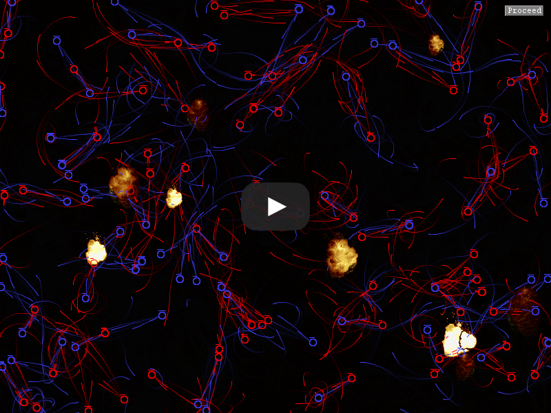

# Balls of War #
Balls of War is a simulation of a bunch of circles shooting at eachother.

### Running the Code ###
The Main class is Main.java. You can compile and run the code with the following commands:
```
mkdir bin
javac -d ./bin -sourcepath ./src ./src/tetris/TetrisPlayer.java
java -cp ./bin tetris/TetrisPlayer
pause
```

Alternatively, the repository comes with a ```compile.bat``` and ```run.bat``` which you should be able to run on Windows if you have the JDK in you system path.

## Video ##
[](https://www.youtube.com/watch?v=Ue8HUMNFBOA&t=54s)

## Evolution of Balls of War

Like many of my projects, the scope of this one grew much faster than I could keep up with. I kept inventing new stats for my units, which required new systems and so much code refactoring that the [Ship of Theseus](https://en.wikipedia.org/wiki/Ship_of_Theseus) comes to mind. Eventually, I added a team editor with a state-of-the-art interface for picking stats and pitting different teams (up to 8) against eachother.

### Unit Stats

- **Health** - How much damage the unit can take befor it is eliminated
- **Vitality** - How fast the unit regenerates health over time
- **Strength** - How much damage bullets shot by this unit inflict on other units that get hit
- **Agility** - How fast the unit moves away from the nearest bullet (which allows them to dodge some bullets)
- **Speed** - How many shots the unit fires per some unit of time (5 seconds, I think)
- **Spread** - The number of degrees of the arc in which the unit's bullets are randomly fired
- **Multishot** - The number of bullets a unit shoots at a time (evenly spaced out across their firing arc and angled according to the unit's accuracy)
- **Weapon Type** - Which type of bullet the unit fires

### Weapon Types
- **Normal** - Bullets fire in a straight line and disappear after hitting a target ( or leaving the field)
- **Orbital** - Bullets track the target at which they were originally aimed and whirlpool inward on them
- **Gravitational** - Bullets continuously evaluate the nearest target and are attracted toward that target
- **Fractal** - Bullets travel a short distance and then split in two and then continue to do this (very OP)
- **Piercing** - Similar to normal bullets but they keep going after hitting their first target

My favorite type **by far** is the gravitational one. I initially had them gravitate toward *all* available targets, but
that ended up being computationally heavy and didn't look as good as choose-the-nearest.

## Code Style Note ##

This project is OLD. I made it in high school and I have since improved my programming abilities quite a bit. I'm still pretty happy with the results though.

## License ##

I am releasing this code under the MIT license found in LICENSE.txt. The MIT license is very persmissive. Read it if you want to know more.
